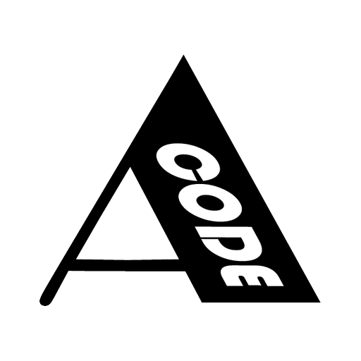

<p align="center">
  
</p>

<h1 align="center">AbdoCode — عبدو كود</h1>

<p align="center">A coding agent that runs on your own Windows machine, with a small deterministic Rust kernel, and works with any model: local through Ollama, or cloud with your own key.</p>

<p align="center">
  <a href="https://github.com/code-ksa/abdocode/releases/latest"><b>⬇ Download the latest Windows installer</b></a>
  ·
  <a href="AGENTS.md">For AI agents</a>
  ·
  <a href="docs/AGENT-PROTOCOL.md">Drive it from your own agent</a>
</p>

---

## Why we built it

AbdoCode is a product of **TechnologyKSA** ([technologyksa.com](https://technologyksa.com)), the Saudi technology company behind **Mubarmij** ([moparmeg-ksa.com](https://moparmeg-ksa.com)). We wanted an agent that lives on the machine, keeps the keys in the machine, and treats the model as an advisor rather than an owner.

The idea is simple: **the model proposes, the kernel decides.** Every effect on your machine goes through one gate, is checked against the mode you chose, and is judged by its receipt, not by what the model says about it. Small models get stricter rails, strong models get thinner ones, automatically.

## What it does

- Reads, writes, edits and runs inside your project, with a preview of every change and a rollback point for every turn.
- Works with small, medium and large models alike. Guards adapt to the model: a wiping write is refused, a repeated bad edit escalates, fabricated command output is caught, and the model is told when it is near its turn budget.
- Sees: browser screenshots and images saved in your project (renders, designs) reach the vision model.
- Reviews itself: "review my changes" runs three independent lenses (correctness, safety, tests) over the turn's diff before you trust it.
- Browses: a built-in agent browser (Edge over CDP), a Chrome/Edge extension to work in your own tabs (it pairs itself with the app, no token to paste), and page tools that read, find, tap, fill and dismiss overlays such as cookie banners or language prompts.
- Connects: Google (Gmail, Calendar, Drive) built in, and remote MCP connectors with OAuth for Slack, Linear, Notion, Asana, Atlassian, Figma, Intercom, Granola, Gamma and GitHub.
- Schedules: routines run turns on a timetable (UTC, paused until you enable them). Remote control from your phone on the local network with a six-digit code.
- Keeps secrets in the Windows vault (DPAPI) on your machine. No cloud account is required.

## Install

1. Download `AbdoCode_<version>_x64-setup.exe` from [Releases](https://github.com/code-ksa/abdocode/releases/latest).
2. Optionally verify the hash against `SHA256SUMS.txt` in the same release.
3. Run the installer. It installs for the current user, no administrator rights needed.
4. Open Settings → Providers and connect a model: Ollama locally, or a cloud provider with your key.

Windows 10/11, 64-bit. Ollama is recommended for local models. The app checks for updates at startup, every six hours while open, and when you return to it, and shows an **Update available** button that opens the release page. Nothing is downloaded or installed without you.

## For developers and for other agents

The source is published for reading and local builds. Tooling is Bun and Rust; the build and the test gates are described in [`docs/DEVELOPMENT.md`](docs/DEVELOPMENT.md), the architecture in [`docs/ARCHITECTURE.md`](docs/ARCHITECTURE.md), the security model in [`docs/SECURITY.md`](docs/SECURITY.md), and the connectors in [`docs/CONNECTORS.md`](docs/CONNECTORS.md).

Why an open model does better work inside this harness than inside a thinner loop is written down in [`docs/MIND.md`](docs/MIND.md), with what is measured and what is next; [`CONTRIBUTING.md`](CONTRIBUTING.md) explains how a measured defect becomes a rule that ships to every installed copy.

AbdoCode is itself an agent, and it is built to be driven by one. [`AGENTS.md`](AGENTS.md) is the entry point for AI agents reading this repository, [`llms.txt`](llms.txt) is the machine-readable index, and [`docs/AGENT-PROTOCOL.md`](docs/AGENT-PROTOCOL.md) describes the framed stdio protocol and the built-in MCP servers you can attach to your own agent.

```powershell
bun install --frozen-lockfile
bun run structure
bun run typecheck
```

## License

AbdoCode is proprietary software with published source. You may read it and use it personally; commercial use requires a written license. See [`LICENSE`](LICENSE) and [`COMMERCIAL.md`](COMMERCIAL.md).

Contact: technoksaweb@gmail.com

---

<details>
<summary><b>بالعربية</b></summary>

**عبدو كود** وكيل برمجة يعمل على جهازك بويندوز، بنواة Rust صغيرة وحتميّة، ويشتغل مع أيّ نموذج: محلّيّ عبر Ollama أو سحابيّ بمفتاحك. النموذج يقترح والنواة تحكم: كلّ أثر على جهازك يمرّ من بوّابة واحدة ويُقاس بإيصاله لا بكلام النموذج.

منتَجٌ من **تكنولوجيا السعودية** ([technologyksa.com](https://technologyksa.com))، صانعة **مبرمج**. نزّل المثبّت من صفحة [الإصدارات](https://github.com/code-ksa/abdocode/releases/latest). المصدر منشور للاطّلاع والبناء المحلّيّ، والاستخدام التجاريّ يحتاج ترخيصاً كتابيّاً (انظر `LICENSE`).

</details>
